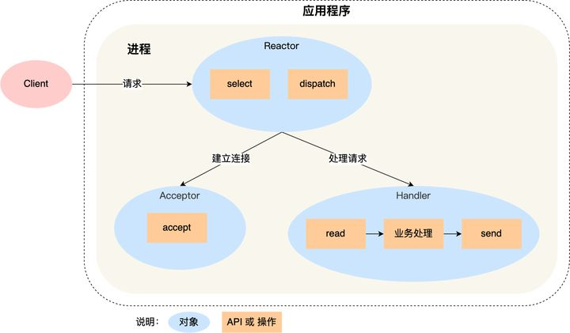

# Redis 源码剖析


---

## 前言

Redis(**Re**mote **Di**ctionary **S**erver)

* Key-Value NoSQL

* 内存 亚毫秒级访问

* 简单的API

> 源码面前，了无秘密 --《STL源码剖析》侯捷

本次分享从源码入手去分析Redis后端的精巧设计
源码为 Redis v3.2.12 (Tencent Dev-Cloud yum 源版本)
涉及到 Redis v6.2.4 (Redis Stable 最新版本)

---

## 目录

* Redis I/O : Reactor 模式

* Redis DB

* Redis 持久化 : AOF / RDB

---

### Reactor 模式 -- 起源

Client / Server结构
redis/3.2.12/src/server.h

```c
struct redisServer {
  /* General */
  // ...
  redisDb *db;
  list *clients;                 /* List of active clients */

  /* Networking */
  // ...
  int ipfd[CONFIG_BINDADDR_MAX]; /* TCP socket file descriptors */
  int ipfd_count;                /* Used slots in ipfd[] */
}
```

多进程 ？ 多线程 ？ 线程池 ？ I/O多路复用 ？ 面向过程编程 ？ 面向对象编程？

---

### Reactor 模式 -- 架构



---

### Reactor 模式 -- 实现(1)

redis/3.2.12/src/ae.h

```c
#ifdef HAVE_EVPORT
#include "ae_evport.c"
#else
    #ifdef HAVE_EPOLL
    #include "ae_epoll.c"
    #else
        #ifdef HAVE_KQUEUE
        #include "ae_kqueue.c"
        #else
        #include "ae_select.c"
        #endif
    #endif
#endif
```

---

### Reactor 模式 -- 实现(2)

redis/3.2.12/src/ae.c

```c
aeEventLoop *aeCreateEventLoop(int setsize) {}

int aeCreateFileEvent(aeEventLoop *eventLoop, int fd, int mask,
        aeFileProc *proc, void *clientData) {}

void aeDeleteFileEvent(aeEventLoop *eventLoop, int fd, int mask) {}

int aeProcessEvents(aeEventLoop *eventLoop, int flags) {}

void aeMain(aeEventLoop *eventLoop) {}

void aeSetBeforeSleepProc(aeEventLoop *eventLoop, aeBeforeSleepProc *beforesleep) {}

```

---

### Reactor 模式 -- 单Reactor瓶颈

跑满 CPU 一个核心，达到瓶颈
单机 QPS 10W

---

### Reactor 模式 -- Redis 6 Multi-Reactor

redis/6.2.4/src/networking.c

```c
void initThreadedIO(void) {
    // ...
    /* Spawn and initialize the I/O threads. */
    for (int i = 0; i < server.io_threads_num; i++) {
        // ...
        pthread_mutex_init(&io_threads_mutex[i],NULL);
        pthread_mutex_lock(&io_threads_mutex[i]); /* Thread will be stopped. */
        if (pthread_create(&tid,NULL,IOThreadMain,(void*)(long)i) != 0) {
            serverLog(LL_WARNING,"Fatal: Can't initialize IO thread.");
            exit(1);
        }
        io_threads[i] = tid;
    }
}
```

---

### Redis DB -- 键空间

redis/3.2.12/src/server.h

```c
typedef struct redisDb {
    dict *dict;                 /* The keyspace for this DB */
    dict *expires;              /* Timeout of keys with a timeout set */
    int id;                     /* Database ID */
    // ...
} redisDb;

typedef struct dictEntry {
    void *key;
    union {
        void *val;
        // ...
    } v;
    struct dictEntry *next;
} dictEntry;
```

---

### Redis DB -- 过期机制

惰性（CPU友好） redis/3.2.12/src/server.c

```c
int expireIfNeeded(redisDb *db, robj *key) {
    mstime_t when = getExpire(db,key);
    mstime_t now;
    if (when < 0) return 0; /* No expire for this key */
    // ...
    return dbDelete(db,key);
}
```

定期（内存友好） redis/3.2.12/src/server.c

```c
int activeExpireCycleTryExpire(redisDb *db, dictEntry *de, long long now) {
    long long t = dictGetSignedIntegerVal(de);
    if (now > t) {
      // ...
    }
}
```

---

### Redis DB -- 对象与编码

```c
typedef struct redisObject {
    unsigned type:4;
    unsigned encoding:4;
    void *ptr;
    // ...
} robj;

#define OBJ_STRING 0
#define OBJ_LIST 1
#define OBJ_SET 2
#define OBJ_ZSET 3
#define OBJ_HASH 4

#define OBJ_ENCODING_RAW 0     /* Raw representation */
#define OBJ_ENCODING_INT 1     /* Encoded as integer */
#define OBJ_ENCODING_HT 2      /* Encoded as hash table */
#define OBJ_ENCODING_ZIPMAP 3  /* Encoded as zipmap */
#define OBJ_ENCODING_LINKEDLIST 4 /* Encoded as regular linked list */
#define OBJ_ENCODING_ZIPLIST 5 /* Encoded as ziplist */
#define OBJ_ENCODING_INTSET 6  /* Encoded as intset */
#define OBJ_ENCODING_SKIPLIST 7  /* Encoded as skiplist */
#define OBJ_ENCODING_EMBSTR 8  /* Embedded sds string encoding */
#define OBJ_ENCODING_QUICKLIST 9 /* Encoded as linked list of ziplists */
```

---

### Redis DB -- 猜猜编码是啥？

```text
// object : string
SET msg1 "hi"
SET msg2 123

// object : hash
HSET book name "Mastering Cpp in 21 days"

// object : zset
ZADD price 10.0 t-shirt 5.0 shoes
```

---

### Redis DB -- ziplist

redis/3.2.12/src/ziplist.h

```c
typedef struct zlentry {
    unsigned int prevrawlensize, prevrawlen;
    unsigned int lensize, len;
    unsigned int headersize;
    unsigned char encoding;
    unsigned char *p;
} zlentry;
```

redis/3.2.12/src/dict.h

```c
typedef struct dict {
    dictType *type;
    dictht ht[2];
    long rehashidx; /* rehashing not in progress if rehashidx == -1 */
    // ...
} dict;
```

---

## Redis 持久化 : RDB (**R**edis **D**ata**B**ase)

redis/3.2.12/src/rdb.c

```c
int rdbSave(char *filename) {}
int rdbLoad(char *filename) { \\ ... }
```

---

## Redis 持久化 : AOF (**A**ppend **O**nly **F**ile)

```c
struct redisServer {
  // ...
  sds aof_buf;
}
```

```text
# appendfsync always
appendfsync everysec
# appendfsync no
```

---

## Redis 持久化 : AOF重写

redis/3.2.12/src/aof.c

```c
int rewriteAppendOnlyFileBackground(void) {
  if ((childpid = redisFork(CHILD_TYPE_AOF)) == 0) {
    /* Child */
    // ...
    if (rewriteAppendOnlyFile(tmpfile) == C_OK) {
            sendChildCowInfo(CHILD_INFO_TYPE_AOF_COW_SIZE, "AOF rewrite");
            exitFromChild(0);
    } else {
      // ...
    }
  } else {
    /* Parent */
    // ...
    replicationScriptCacheFlush();
  }
}
```
